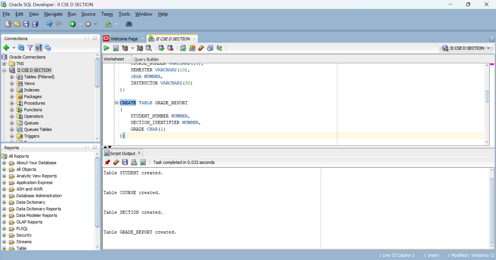
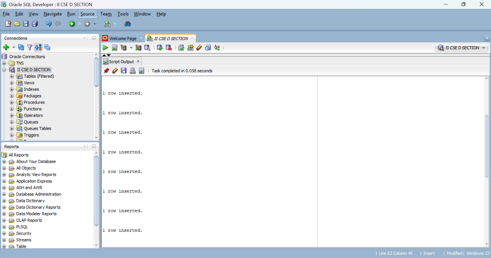
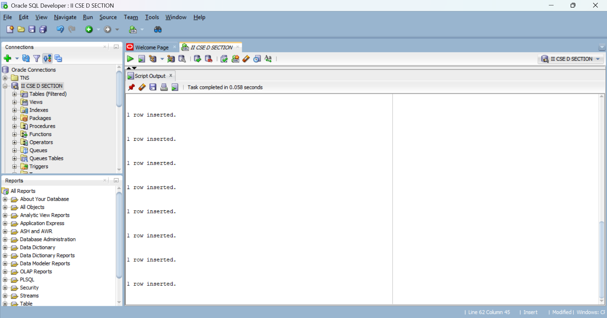
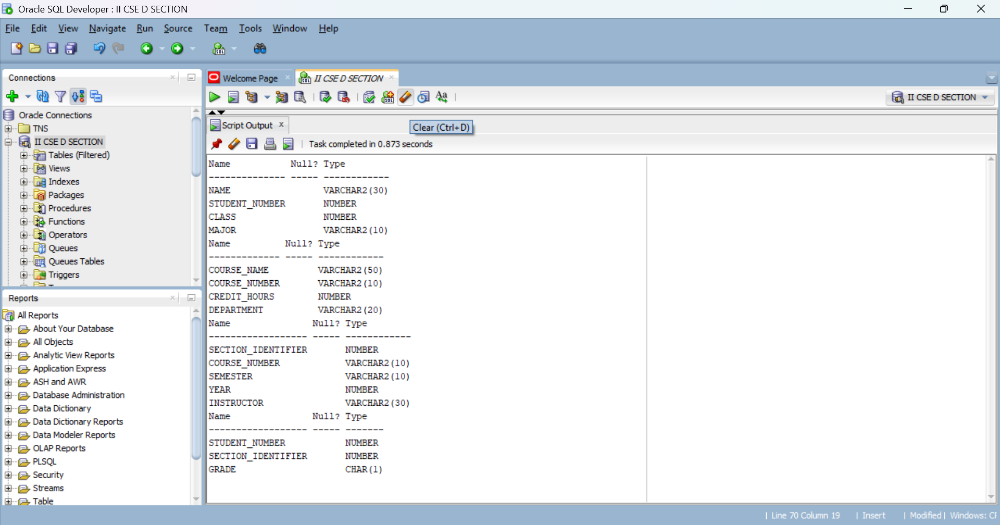
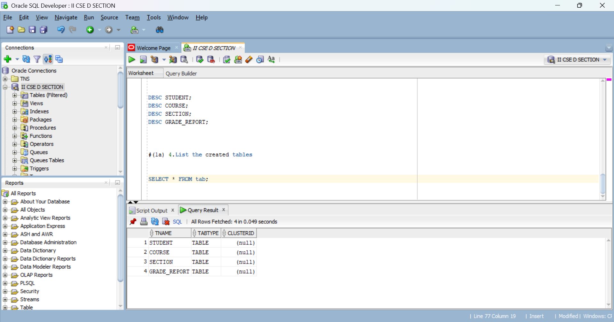
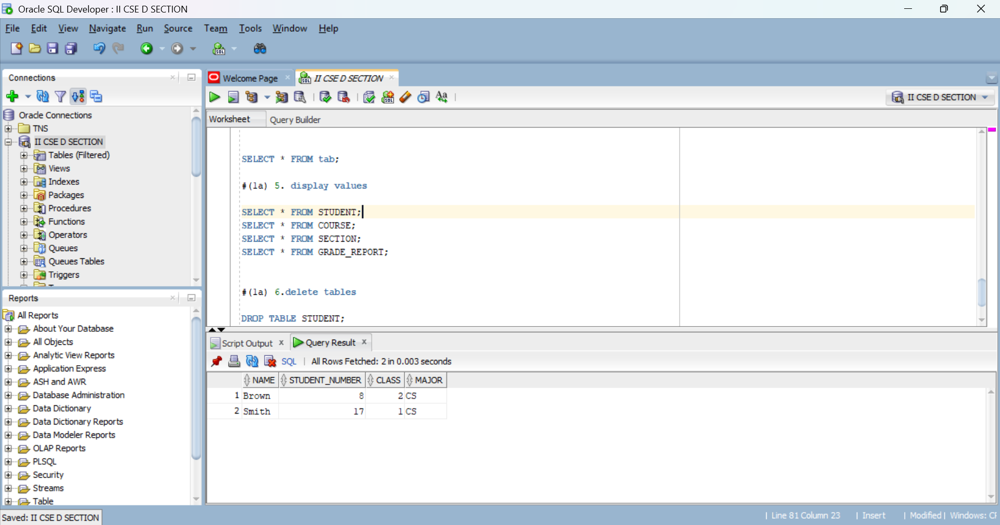
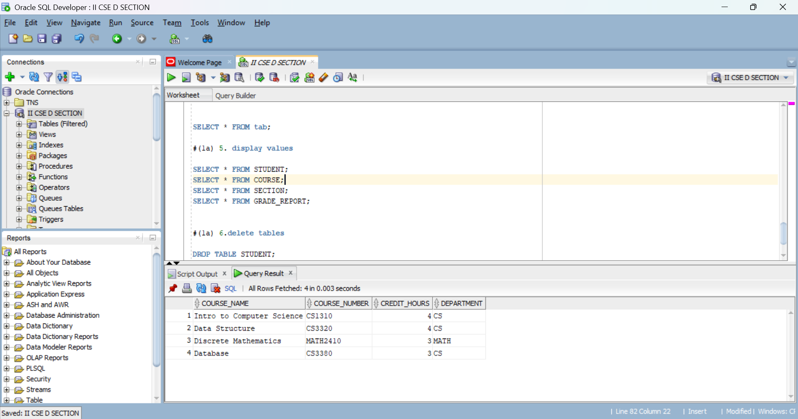
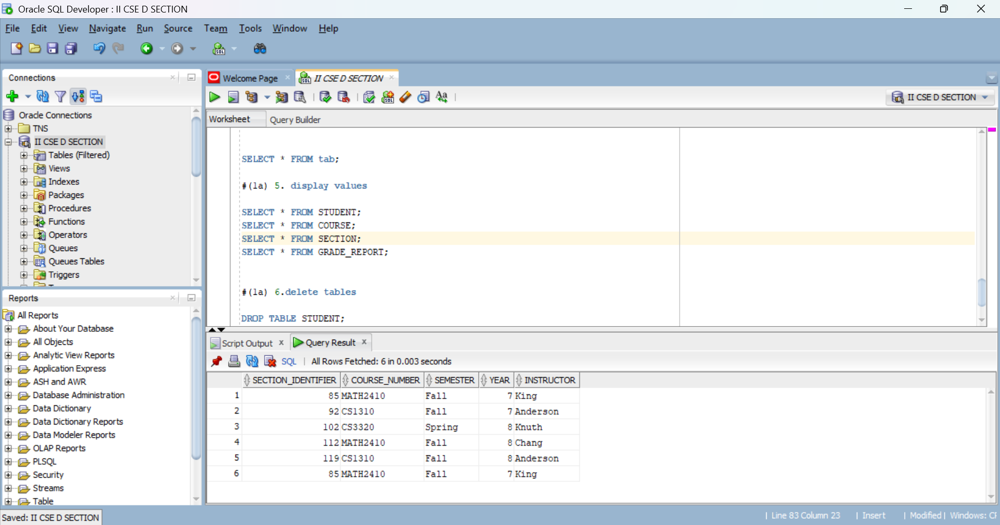
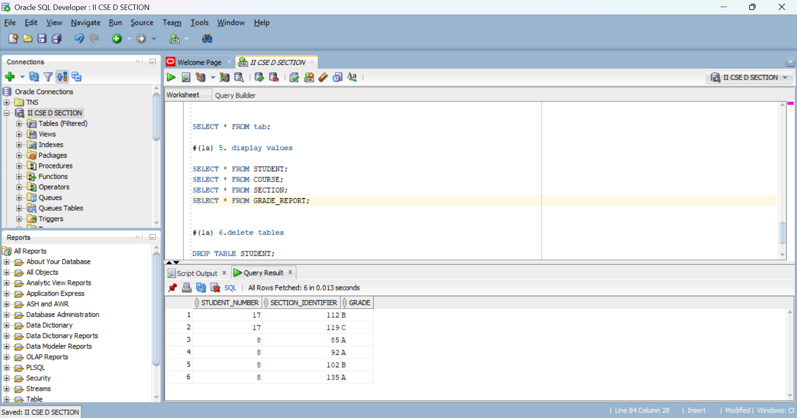
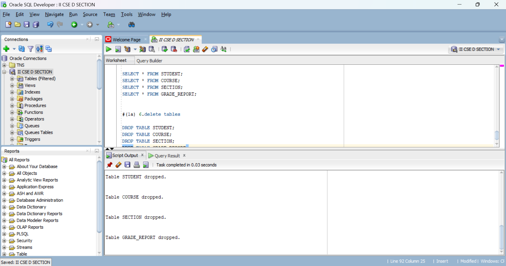

# (1a) 1.Create table from the databases given without constraints

CREATE TABLE STUDENT
(
    NAME VARCHAR2(30),
    STUDENT_NUMBER NUMBER,
    CLASS NUMBER,
    MAJOR VARCHAR2(10)
);

CREATE TABLE COURSE
(
    COURSE_NAME VARCHAR2(50),
    COURSE_NUMBER VARCHAR2(10),
    CREDIT_HOURS NUMBER,
    DEPARTMENT VARCHAR2(20)
);

CREATE TABLE SECTION
(
    SECTION_IDENTIFIER NUMBER,
    COURSE_NUMBER VARCHAR2(10),
    SEMESTER VARCHAR2(10),
    YEAR NUMBER,
    INSTRUCTOR VARCHAR2(30)
);

CREATE TABLE GRADE_REPORT
(
    STUDENT_NUMBER NUMBER,
    SECTION_IDENTIFIER NUMBER,
    GRADE CHAR(1)
);

#(1a) 2. Insert all values inside the tables

INSERT INTO STUDENT VALUES ('Smith',17,1,'CS');
INSERT INTO STUDENT VALUES ('Brown',8,2,'CS');

INSERT INTO COURSE VALUES ('Intro to Computer Science','CS1310',4,'CS');
INSERT INTO COURSE VALUES ('Data Structure','CS3320',4,'CS');
INSERT INTO COURSE VALUES ('Discrete Mathematics','MATH2410',3,'MATH');
INSERT INTO COURSE VALUES ('Database','CS3380',3,'CS');

INSERT INTO SECTION VALUES (85,'MATH2410','Fall',7,'King');
INSERT INTO SECTION VALUES (92,'CS1310','Fall',7,'Anderson');
INSERT INTO SECTION VALUES (102,'CS3320','Spring',8,'Knuth');
INSERT INTO SECTION VALUES (112,'MATH2410','Fall',8,'Chang');
INSERT INTO SECTION VALUES (119,'CS1310','Fall',8,'Anderson');

INSERT INTO GRADE_REPORT VALUES (17,112,'B');
INSERT INTO GRADE_REPORT VALUES (17,119,'C');
INSERT INTO GRADE_REPORT VALUES (8,85,'A');
INSERT INTO GRADE_REPORT VALUES (8,92,'A');
INSERT INTO GRADE_REPORT VALUES (8,102,'B');
INSERT INTO GRADE_REPORT VALUES (8,135,'A');

#(1a) 3.Describe all tables

DESC STUDENT;
DESC COURSE;
DESC SECTION;
DESC GRADE_REPORT;

#(1a) 4.List the created tables

SELECT * FROM tab;

#(1a) 5. display table values

SELECT * FROM STUDENT;
SELECT * FROM COURSE;
SELECT * FROM SECTION;
SELECT * FROM GRADE_REPORT;

#(1a) 6.delete all tables

DROP TABLE STUDENT;
DROP TABLE COURSE;
DROP TABLE SECTION;
DROP TABLE GRADE_REPORT;

